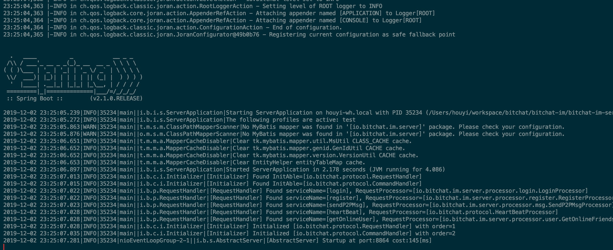
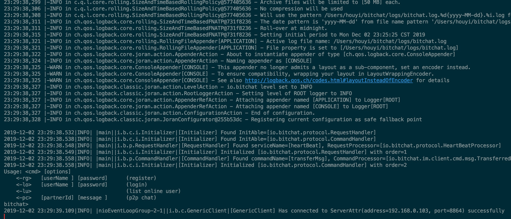
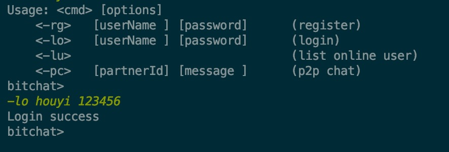
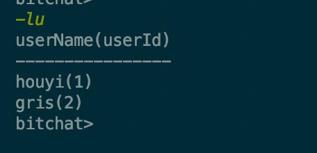
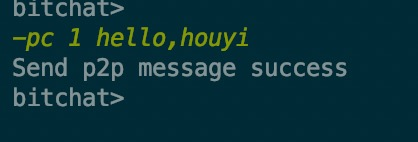
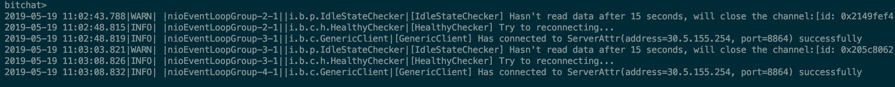
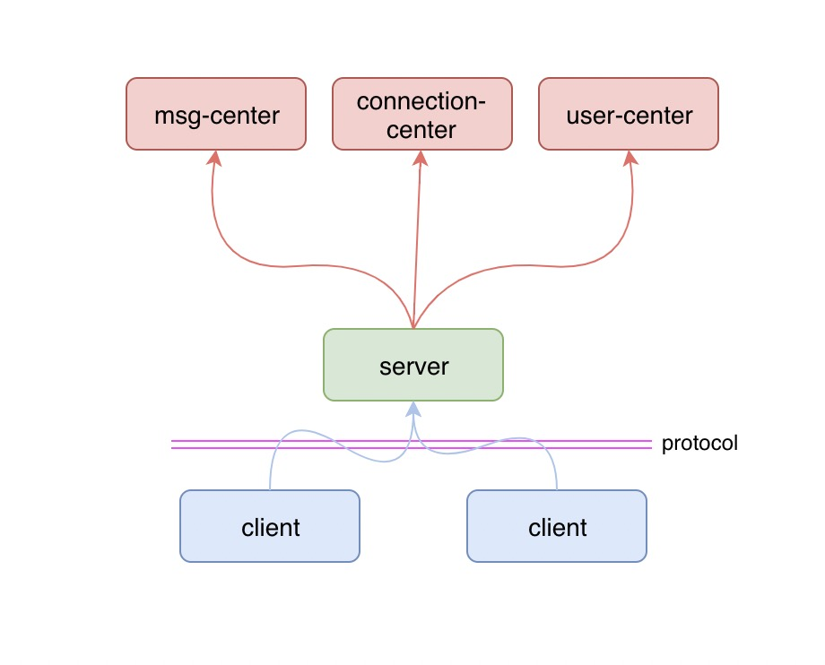
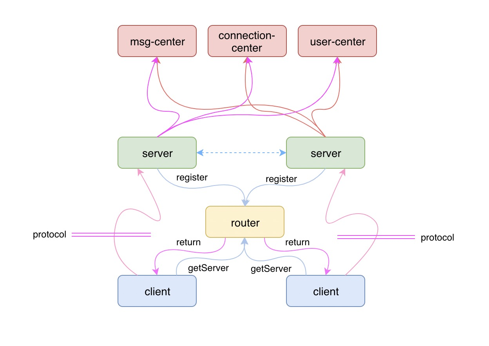

# bitchat

**bitchat** 是一个基于 Netty 的 IM 即时通讯框架

 **特性:**

- [x] **IOC容器** : 通过 @Bean 注解可以管理所有对象，通过 @Autowired 注解进行对象注入
- [x] **自定义协议**  : 一个自定义的 Packet 协议，业务的扩展非常简单
- [x] **编解码器**  : 内置 PacketCodec 编解码器，解决拆包粘包的问题
- [x] **业务处理器**  : 业务处理器 PacketHandler 与 Packet 分离，支持各种自定义业务处理器
- [x] **可选的业务处理方式**  : 服务端支持同步或异步的业务处理， 可以由客户端在 Packet 协议中自主选择，默认是在业务线程池中异步处理
- [x] **可选的序列化方式**  : 支持多种序列化方式，可以由客户端在 Packet 协议中自主选择，默认是 ProtoStuff方式
- [x] **单机模式**  : 支持单机模式
- [x] **心跳检测** : 服务端与客户端自带心跳检查机制，客户端支持断线重连

**TODO：**

- [ ] **集群模式**  : 支持服务端的集群方式部署，形成一个 Router 层，客户端通过 Router 获取可用的服务端实例
- [ ] **Connection中心** : 一个 Connection 中心，目前是在内存中保存，未来需要支持 Connection 的持久化，
- [ ] **Message中心**  : 消息的存储的查询
- [ ] **User中心**  : 用户与群组的管理


## 快速开始

**bitchat-example** 模块提供了一个服务端与客户端的实现示例，可以参照该示例进行自己的业务实现。


### 启动服务端

要启动服务端，需要获取一个 Server 的实例，可以通过 ServerFactory 来获取。

目前只实现了单机模式下的 Server ，通过 SimpleServerFactory 只需要定义一个端口即可获取一个单机的 Server 实例，如下所示：

```java
public class StandaloneServerApplication {
    public static void main(String[] args) {
        Server server = SimpleServerFactory.getInstance()
            .newServer(8864);
        server.start();
    }
}
```

服务端启动成功后，将显示如下信息：



###  

### 启动客户端

目前只实现了直连服务器的客户端，通过 SimpleClientFactory 只需要指定一个 ServerAttr 即可获取一个客户端，然后进行客户端与服务端的连接，如下所示：

```java
public class DirectConnectServerClientApplication {

    public static void main(String[] args) {
        Client client = SimpleClientFactory.getInstance()
            .newClient(ServerAttr.getLocalServer(8864));
        client.connect();

        doClientBiz(client);
    }
}
```

客户端连接上服务端后，将显示如下信息：




#### 体验客户端的功能

目前客户端提供了三种 Func，分别是：登录，查看在线用户列表，发送单聊消息，每种 Func 有不同的命令格式。


##### 登录

通过在客户端中执行以下命令 `-lo houyi 123456` 即可实现登录，目前用户中心还未实现，通过 Mock 的方式实现一个假的用户服务，所以输入任何的用户名密码都会登录成功，并且会为用户创建一个用户id。

登录成功后，显示如下：




##### 查看在线用户

再启动一个客户端，并且也执行登录，登录成功后，可以执行 `-lu` 命令，获取在线用户列表，目前用户是保存在内存中，获取的结果如下所示：




##### 发送单聊信息

用 gris 这个用户向 houyi 这个用户发送单聊信息，只要执行 `-pc 1 hello,houyi` 命令即可

其中第二个参数数要发送消息给那个用户的用户id，第三个参数是消息内容

消息发送方，发送完消息：




消息接收方，接收到消息：


#### 客户端断线重连

客户端和服务端之间维持着心跳，双方都会检查连接是否可用，客户端每隔5s会向服务端发送一个 PingPacket，而服务端接收到这个 PingPacket 之后，会回复一个 PongPacket，这样表示双方都是健康的。

当因为某种原因，服务端没有收到客户端发送的消息，服务端将会把该客户端的连接断开，同样的客户端也会做这样的检查。

当客户端与服务端之间的连接断开之后，将会触发客户端 HealthyChecker 的 channelInactive 方法，从而进行客户端的断线重连。




## 整体架构

### 单机版

单机版的架构只涉及到服务端、客户端，另外有两者之间的协议层，如下图所示：



除了服务端和客户端之外，还有三大中心：消息中心，用户中心，链接中心。

- 消息中心：主要负责消息的存储与历史、离线消息的查询
- 用户中心：主要负责用户和群组相关的服务
- 链接中心：主要负责保存客户端的链接，服务端从链接中心获取客户端的链接，向其推送消息


### 集群版

单机版无法做到高可用，性能与可服务的用户数也有一定的限制，所以需要有可扩展的集群版，集群版在单机版的基础上增加了一个路由层，客户端通过路由层来获得可用的服务端地址，然后与服务端进行通讯，如下图所示：



客户端发送消息给另一个用户，服务端接收到这个请求后，从 Connection中心中获取目标用户“挂”在哪个服务端下，如果在自己名下，那最简单直接将消息推送给目标用户即可，如果在其他服务端，则需要将该请求转交给目标服务端，让目标服务端将消息推送给目标用户。


## 自定义协议

通过一个自定义协议来实现服务端与客户端之间的通讯，协议中有如下几个字段：

```java
*
* <p>
* The structure of a Packet is like blow:
* +----------+----------+----------------------------+
* |  size    |  value   |  intro                     |
* +----------+----------+----------------------------+
* | 1 bytes  | 0xBC     |  magic number              |
* | 1 bytes  |          |  serialize algorithm       |
* | 4 bytes  |          |  packet symbol             |
* | 4 bytes  |          |  content length            |
* | ? bytes  |          |  the content               |
* +----------+----------+----------------------------+
* </p>
*
```

每个字段的含义

| 所占字节 | 用途              |
| -------- | ----------------- |
| 1        | 魔数，默认为 0xBC |
| 1        | 序列化的算法      |
| 4        | Packet 的类型     |
| 4        | Packet 的内容长度 |
| ?        | Packet 的内容     |

序列化算法将会决定该 Packet 在编解码时，使用何种序列化方式。

Packet 的类型将会决定到达服务端的字节流将被反序列化为何种 Packet，也决定了该 Packet 将会被哪个 PacketHandler 进行处理。

内容长度将会解决 Packet 的拆包与粘包问题，服务端在解析字节流时，将会等到字节的长度达到内容的长度时，才进行字节的读取。

除此之外，Packet 中还会存储一个 sync 字段，该字段将指定服务端在处理该 Packet 的数据时是否需要使用异步的业务线程池来处理。


## 健康检查

服务端与客户端各自维护了一个健康检查的服务，即 Netty 为我们提供的 IdleStateHandler，通过继承该类，并且实现 channelIdle 方法即可实现连接 “空闲” 时的逻辑处理，当出现空闲时，目前我们只关心读空闲，我们既可以认为这条链接出现问题了。

那么只需要在链接出现问题时，将这条链接关闭即可，如下所示：

```java
public class IdleStateChecker extends IdleStateHandler {

    private static final int DEFAULT_READER_IDLE_TIME = 15;

    private int readerTime;

    public IdleStateChecker(int readerIdleTime) {
        super(readerIdleTime == 0 ? DEFAULT_READER_IDLE_TIME : readerIdleTime, 0, 0, TimeUnit.SECONDS);
        readerTime = readerIdleTime == 0 ? DEFAULT_READER_IDLE_TIME : readerIdleTime;
    }

    @Override
    protected void channelIdle(ChannelHandlerContext ctx, IdleStateEvent evt) {
        log.warn("[{}] Hasn't read data after {} seconds, will close the channel:{}", 
        IdleStateChecker.class.getSimpleName(), readerTime, ctx.channel());
        ctx.channel().close();
    }

}
```

另外，客户端需要额外再维护一个健康检查器，正常情况下他负责定时向服务端发送心跳，当链接的状态变成 inActive 时，该检查器将负责进行重连，如下所示：

```java
public class HealthyChecker extends ChannelInboundHandlerAdapter {

    private static final int DEFAULT_PING_INTERVAL = 5;

    private Client client;

    private int pingInterval;

    public HealthyChecker(Client client, int pingInterval) {
        Assert.notNull(client, "client can not be null");
        this.client = client;
        this.pingInterval = pingInterval <= 0 ? DEFAULT_PING_INTERVAL : pingInterval;
    }

    @Override
    public void channelActive(ChannelHandlerContext ctx) throws Exception {
        super.channelActive(ctx);
        schedulePing(ctx);
    }

    private void schedulePing(ChannelHandlerContext ctx) {
        ctx.executor().schedule(() -> {
            Channel channel = ctx.channel();
            if (channel.isActive()) {
                log.debug("[{}] Send a PingPacket", HealthyChecker.class.getSimpleName());
                channel.writeAndFlush(new PingPacket());
                schedulePing(ctx);
            }
        }, pingInterval, TimeUnit.SECONDS);
    }

    @Override
    public void channelInactive(ChannelHandlerContext ctx) throws Exception {
        ctx.executor().schedule(() -> {
            log.info("[{}] Try to reconnecting...", HealthyChecker.class.getSimpleName());
            client.connect();
        }, 5, TimeUnit.SECONDS);
        ctx.fireChannelInactive();
    }

}
```


## 业务线程池

我们知道，Netty 中维护着两个 IO 线程池，一个 boss 主要负责链接的建立，另外一个 worker 主要负责链接上的数据读写，我们不应该使用 IO 线程来处理我们的业务，因为这样很可能会对 IO 线程造成阻塞，导致新链接无法及时建立或者数据无法及时读写。

为了解决这个问题，我们需要在业务线程池中来处理我们的业务逻辑，但是这并不是绝对的，如果我们要执行的逻辑很简单，不会造成太大的阻塞，则可以直接在 IO 线程中处理，比如客户端发送一个 Ping 服务端回复一个 Pong，这种情况是没有必要在业务线程池中进行处理的，因为处理完了最终还是要交给 IO 线程去写数据。但是如果一个业务逻辑需要查询数据库或者读取文件，这种操作往往比较耗时间，所以就需要将这些操作封装起来交给业务线程池去处理。

服务端允许客户端在传输的 Packet 中指定采用何种方式进行业务的处理，服务端在将字节流解码成 Packet 之后，会根据 Packet 中的 sync 字段的值，确定怎样对该 Packet 进行处理，如下所示：

```java
public class ServerPacketDispatcher extends 
    SimpleChannelInboundHandler<Packet> {
    @Override
    public void channelRead0(ChannelHandlerContext ctx, Packet request) {
        // if the packet should be handled async
        if (request.getAsync() == AsyncHandle.ASYNC) {
            EventExecutor channelExecutor = ctx.executor();
            // create a promise
            Promise<Packet> promise = new DefaultPromise<>(channelExecutor);
            // async execute and get a future
            Future<Packet> future = executor.asyncExecute(promise, ctx, request);
            future.addListener(new GenericFutureListener<Future<Packet>>() {
                @Override
                public void operationComplete(Future<Packet> f) throws Exception {
                    if (f.isSuccess()) {
                        Packet response = f.get();
                        writeResponse(ctx, response);
                    }
                }
            });
        } else {
            // sync execute and get the response packet
            Packet response = executor.execute(ctx, request);
            writeResponse(ctx, response);
        }
    }
}
```


## 不止是IM框架

**bitchat** 除了可以作为 IM 框架之外，还可以作为一个通用的通讯框架。

Packet 作为通讯的载体，通过继承 AbstractPacket 即可快速实现自己的业务，搭配 PacketHandler 作为数据处理器即可实现客户端与服务端的通讯。